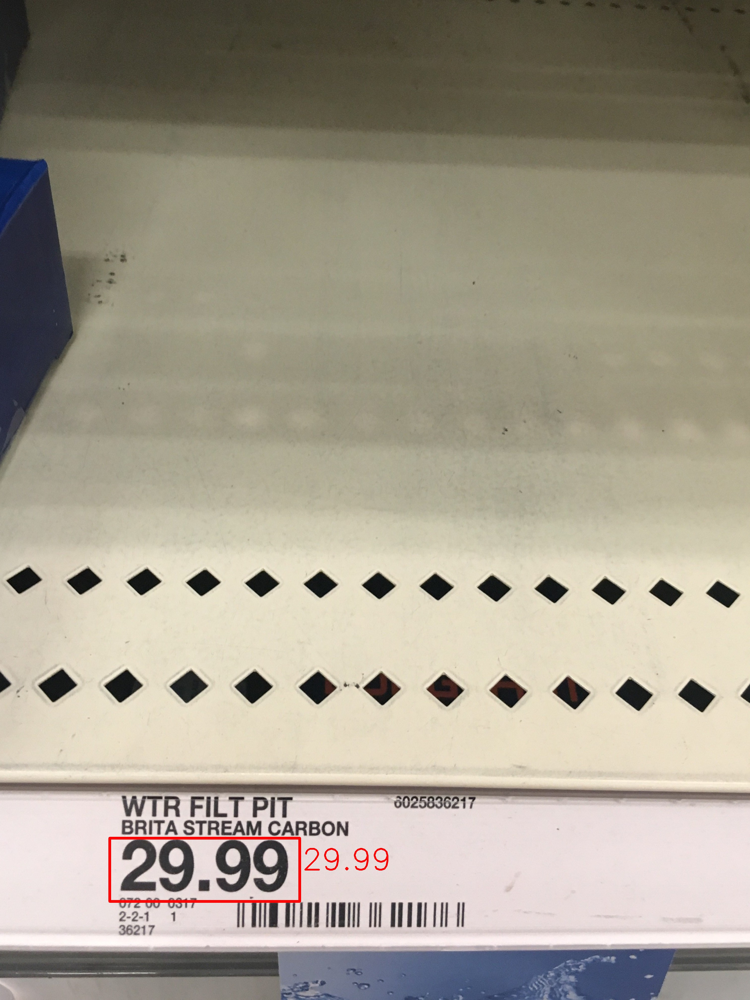

# Price Recognition

This is an example of a server client application that helps for price recognition from an image captured by the phone.

## Server side

- Install [Docker](https://www.docker.com/products/docker-desktop).

- Build the Docker image using the configurations inside the Dockerfile. The name of the image is object-detect.

```bash
docker build -t object-detect ./tf-serve
```

- Run the Docker image.

```bash
docker run --name object-detect -h 0.0.0.0 --network="host" --rm -d object-detect:latest
# --name        For easy referencing this container
# --network     Setup network as host
# --rm          Removes container when it is stopped
# -d            Daemonize the docker container
# -h            Setup hostname, so we can access it using localhost
```

- Models are available on [Google Drive]()

## Client side

- Install requirement (python version > 3.x)

```base
pip3 install -r requirement.txt
```

- Run server

```bash
python api/predict.py
```

## sample of price bbox detection and price compute results



## Licence
MIT
